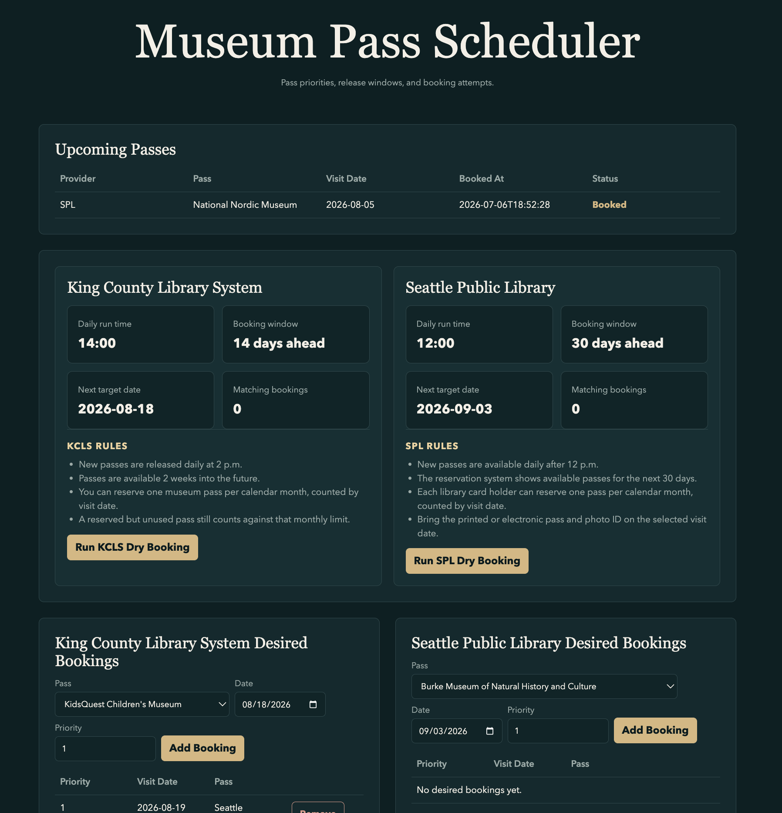

# Seattle Library Museum Passes Automation

A local Python automation app for booking free museum and attraction passes from the King County Library System and The Seattle Public Library.

The app keeps a prioritized booking queue, checks each provider's release window, uses Playwright to complete the LibCal reservation flow, logs every attempt, and can email a success or failure summary.



## Features

- Separate KCLS and SPL provider schedules, credentials, pass catalogs, and dashboard sections
- KCLS release window: daily at 2 p.m. for dates 14 days ahead
- SPL release window: daily after 12 p.m. for dates in the next 30 days
- Prioritized desired bookings by provider/date
- One successful booking per provider/month before backup choices are skipped
- Guarded live mode that stops before final submit unless explicitly enabled
- Local dashboard for managing desired bookings and reviewing attempts
- Upcoming passes view based on successful future booking attempts
- SMTP email notifications for live booking success/failure
- Real pass catalog refresh from KCLS and SPL LibCal pass directories

## Safety And Privacy

Secrets and personal booking data are intentionally kept out of Git.

Ignored local files:

- `.env`
- `data/desired_bookings.json`
- `data/results.jsonl`
- `artifacts/`

Before publishing, confirm:

```bash
git status --short
git ls-files | rg '(^\.env$|desired_bookings\.json$|results\.jsonl$|artifacts/)'
```

The second command should print nothing.

Do not commit real library card numbers, PINs, SMTP app passwords, screenshots, saved HTML artifacts, or personal booking queues.

This local repo is configured to use a GitHub noreply email for commit author metadata.


## Quick Start

Create and activate a virtual environment:

```bash
python3 -m venv .venv
source .venv/bin/activate
python -m pip install -U pip
python -m pip install -e ".[automation]"
python -m playwright install chromium
```

Create your local secret file:

```bash
cp .env.example .env
```

Fill in `.env`:

```bash
KCLS_LIBRARY_CARD_NUMBER=...
KCLS_LIBRARY_PIN=...
KCLS_LIBRARY_EMAIL=...

SPL_LIBRARY_CARD_NUMBER=...
SPL_LIBRARY_PIN=...
SPL_LIBRARY_EMAIL=...

LIBRARY_ALLOW_LIVE_SUBMIT=0
```

Keep `LIBRARY_ALLOW_LIVE_SUBMIT=0` while testing. Set it to `1` only when you are ready for the app to submit real reservations.

Create your personal booking queue:

```bash
cp data/desired_bookings.example.json data/desired_bookings.json
```

`data/desired_bookings.json` is ignored by Git.

## Common Commands

Run the dashboard:

```bash
.venv/bin/python -m src.main --web
```

Then open:

```text
http://127.0.0.1:8000
```

Show today's matching booking plan:

```bash
.venv/bin/python -m src.main --show-plan
.venv/bin/python -m src.main --show-plan --provider kcls
.venv/bin/python -m src.main --show-plan --provider spl
```

Run one provider once:

```bash
.venv/bin/python -m src.main --run-once --provider kcls
.venv/bin/python -m src.main --run-once --provider spl
```

Run the local scheduler:

```bash
caffeinate -i .venv/bin/python -m src.main --schedule
```

On macOS, `caffeinate -i` helps keep the computer awake while the scheduler waits for the noon and 2 p.m. runs.

Refresh public pass catalogs:

```bash
.venv/bin/python -m src.main --refresh-passes --provider kcls
.venv/bin/python -m src.main --refresh-passes --provider spl
```

Capture live pages for selector debugging:

```bash
.venv/bin/python -m src.main --inspect-live-site --provider kcls
.venv/bin/python -m src.main --inspect-live-site --provider spl
```

## Desired Bookings

Desired bookings are stored locally in `data/desired_bookings.json`.

Example:

```json
[
  {
    "date": "2026-07-20",
    "pass_name": "Woodland Park Zoo",
    "priority": 1,
    "provider": "kcls"
  },
  {
    "date": "2026-07-20",
    "pass_name": "MOPOP",
    "priority": 2,
    "provider": "kcls"
  },
  {
    "date": "2026-08-05",
    "pass_name": "National Nordic Museum",
    "priority": 1,
    "provider": "spl"
  }
]
```

Lower priority numbers run first. If a booking succeeds, later backup choices for that same provider and visit month are skipped.

## Notifications

The app sends email directly from Python via SMTP. Cloud hosting is only responsible for running the script on schedule.

For Gmail, use a Google app password, not your normal Google password:

```bash
NOTIFY_EMAIL_ENABLED=1
NOTIFY_EMAIL_TO=your_email@example.com
SMTP_HOST=smtp.gmail.com
SMTP_PORT=587
SMTP_USERNAME=your_email@example.com
SMTP_PASSWORD=your_16_character_app_password
SMTP_FROM=your_email@example.com
```

Test notifications:

```bash
.venv/bin/python -m src.main --send-test-email
```

Notification behavior:

- Success: email with provider, pass, visit date, and attempt details
- Failure after live attempts: email with each attempted pass and failure reason
- No matching booking plan: no email
- Dry runs: no email
- Missing SMTP config: booking continues and notification is skipped

## Dashboard

The local dashboard includes:

- Upcoming passes from successful future booking attempts
- KCLS and SPL schedule/rules panels
- Separate KCLS and SPL desired booking forms
- Separate KCLS and SPL pass catalog sections
- Recent attempt history
- Provider-specific dry-run buttons

The Upcoming Passes section is currently based on this app's successful attempt log. If a pass is cancelled manually on the library site, the dashboard may stay stale until the future account-sync feature is added.

## Provider Rules

KCLS:

- New passes are released daily at 2 p.m.
- Passes are available 2 weeks into the future.
- Default local run time is `14:00`.
- You can reserve one museum pass per calendar month, counted by visit date.
- A reserved but unused pass still counts against the monthly limit.

SPL:

- New passes are available daily after 12 p.m.
- The reservation system shows available passes for the next 30 days.
- Default local run time is `12:00`.
- Each library card holder can reserve one pass per calendar month, counted by visit date.
- Bring the printed or electronic pass and photo ID on the selected visit date.

## Oracle Cloud Cron Deployment

On an Ubuntu VM:

1. Clone the repo.
2. Install Python dependencies and Playwright Chromium.
3. Create `.env` on the VM.
4. Set the VM timezone to Pacific time or configure cron's timezone explicitly.
5. Add separate cron entries for SPL and KCLS.

Example:

```cron
2 12 * * * cd /home/ubuntu/library-tool && /home/ubuntu/library-tool/.venv/bin/python -m src.main --run-once --provider spl >> /home/ubuntu/library-tool/logs/spl-booking.log 2>&1
2 14 * * * cd /home/ubuntu/library-tool && /home/ubuntu/library-tool/.venv/bin/python -m src.main --run-once --provider kcls >> /home/ubuntu/library-tool/logs/kcls-booking.log 2>&1
```

Useful checks:

```bash
date
timedatectl
crontab -l
tail -100 logs/spl-booking.log
tail -100 logs/kcls-booking.log
```

Set Pacific time if desired:

```bash
sudo timedatectl set-timezone America/Los_Angeles
```

## Tests

Run the test suite:

```bash
.venv/bin/python -m unittest discover -s tests -q
```

Run a quick syntax check:

```bash
.venv/bin/python -m py_compile src/booker.py src/config.py src/main.py src/notifier.py src/results.py src/web_app.py
```

## Project Structure

- `.env.example` - environment variable template
- `config.yaml` - provider schedules
- `data/passes.json` - public provider pass catalog
- `data/desired_bookings.example.json` - safe example booking queue
- `src/booker.py` - Playwright booking workflow
- `src/config.py` - config and JSON data loading
- `src/main.py` - CLI entry point and scheduler
- `src/notifier.py` - SMTP email notifications
- `src/results.py` - attempt logging
- `src/web_app.py` - local dashboard
- `tests/` - unit tests

## Disclaimer

This is a personal automation project and portfolio example. Use it responsibly, respect library terms and limits, and keep real credentials out of version control.
